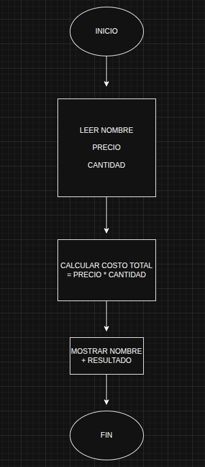

# Mi Programa de Inventario 🛒

¡Hola! Este es un programa de inventario. Te pide el nombre de un producto y calcula cuánto cuesta todo junto.

## ¿Qué hace? 🤔

- Te pregunta el nombre del producto, como "manzana" o "juguete".
- Te pregunta cuánto cuesta uno solo (el precio).
- Te pregunta cuántos quieres comprar.
- Si pones algo malo, como letras en lugar de números, te dice "¡Uy! Prueba otra vez".
- Al final, te dice cuánto cuesta todo: precio por cantidad.

## Cómo jugar con él 🎮

1. Abre el programa llamado `inventario.py`.
2. Escribe el nombre del producto cuando te pregunte.
3. Escribe el precio (solo números, como 10 o 5.50).
4. Escribe la cantidad (solo números enteros, como 3 o 10).
5. ¡Mira el mensaje al final con todo lo que calculó!

## Ejemplo divertido 🍎

Imagina que quieres comprar manzanas:

- Nombre: manzana
- Precio: 2.50
- Cantidad: 4

El programa dice: "Producto: manzana | Precio: 2.50 | Cantidad: 4 | Total: 10.0"

¡Eso significa que 4 manzanas cuestan 10 monedas!

## ¿Por qué es genial? 🌟

Es como hacer cuentas en la tienda, pero la computadora lo hace por ti. ¡Y si te equivocas, te ayuda a arreglarlo!

¡Diviértete jugando con números! 😊

---

